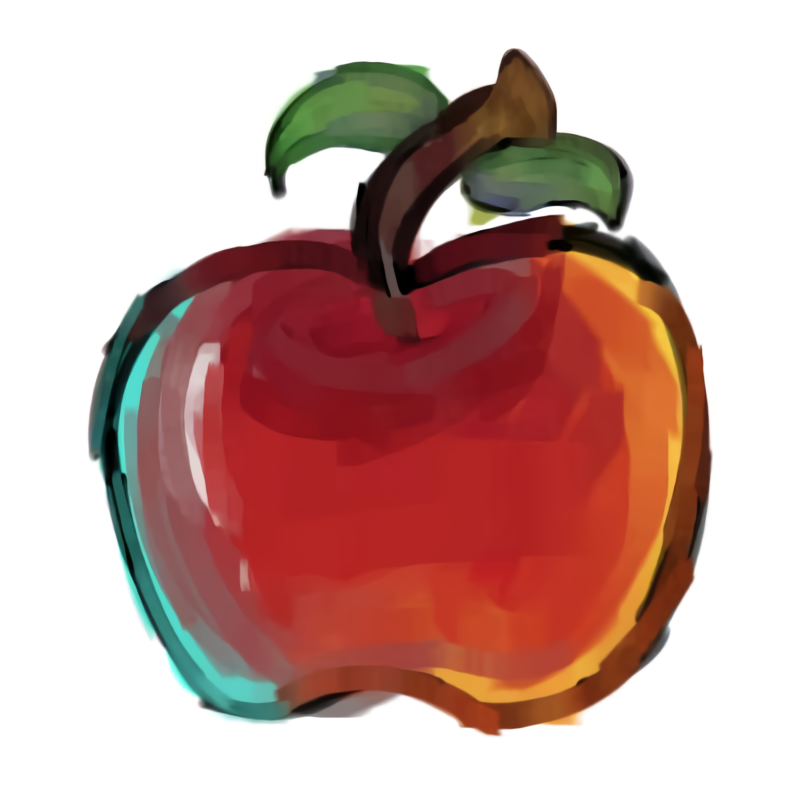

<div align="center">



# Studio POMAR
### *Vozes que criam raízes · Síntese Vocal Livre & Comunitária*

[](https://studiopomar.github.io/pomar-lts/)
[](https://nextjs.org/)
[](https://react.dev/)
[](https://tailwindcss.com/)
[](https://opensource.org/licenses/MIT)

<br />

[Português](#sobre-o-studio-pomar) • [English](#sobre-o-studio-pomar) • [العربية](#sobre-o-studio-pomar) • [Русский](#sobre-o-studio-pomar) • [日本語](#sobre-o-studio-pomar)

<br />

</div>

---

## Sobre o Studio POMAR

O **Studio POMAR** é um coletivo brasileiro dedicado à criação, preservação e difusão de bancos de voz (*voicebanks*) e ferramentas livres para **UTAU**, **OpenUTAU**, **DiffSinger** e tecnologias de síntese vocal.

Nascido da convicção de que a tecnologia de voz não deve ser um recurso distante, fechado ou descartável, cultivamos projetos com suporte de longo prazo (**LTS**), prezando pela autonomia dos artistas, documentação transparente e respeito ao processo artesanal de afinação.

---

## Vozes Integrantes

| Voz | Geração / Origem | Motores Suportados | Idiomas |
| :--- | :--- | :--- | :--- |
| **VIICTOR** *(FIIKTUR)* | 4ª Geração · desde 2013 | UTAU, OpenUTAU, DiffSinger, NiaoNiao, DeepVocal, NNSVS, Kamafeu, Cadencii | Português, Japonês, Inglês, Árabe (+30 idiomas) |
| **YOHJI** | 2ª Geração · desde 2010 | UTAU, OpenUTAU, DiffSinger | Português, Japonês, Espanhol |
| **EDDIE** | 4ª Geração · desde 2012 | UTAU, OpenUTAU, SVV | Português Brasileiro (Pioneiro), Japonês |
| **MIZUKI** *(観月)* | 7ª Geração · desde 2015 | UTAU, OpenUTAU, DiffSinger | Português, Japonês, Inglês |
| **LLANE CROW** | Internacional · Rússia | UTAU, OpenUTAU, DiffSinger, Neural Synth | Russo, Inglês, Japonês |

---

## Ferramentas em Destaque

- **[KAMAFEU](https://github.com/studiopomar/kamafeu)**: Sintetizador concatenativo multifaixa e piano roll em Rust, com processamento DSP nativo de alta fidelidade e controle de afinação artesanal.
- **[COPAÍBA NEO](https://github.com/studiopomar/Copaiba-NEO)**: Nova geração de editores de `oto.ini` multiplataforma em Rust com gravação de áudio embutida, seleção múltipla e plugins inteligentes de consistência.
- **[COPAÍBA LEXIKON LTS](https://github.com/studiopomar/Copaiba-Lexicon-LTS)**: Editor de `oto.ini` estável em Python com análise detalhada de forma de onda, mini-mapa, presets customizáveis e processamento em lote.

---

## Internacionalização (i18n)

O site conta com suporte completo a 5 idiomas, com chaveamento instantâneo, persistência em `localStorage` e suporte nativo à direção de leitura **RTL (Right-to-Left)**:
- **Português (BR)**
- **English (US)**
- **العربية (AR)** *(com alinhamento RTL nativo)*
- **Русский (RU)**
- **日本語 (JA)**

---

## Desenvolvimento Local

Para rodar o projeto localmente em seu ambiente de desenvolvimento:

```bash
# 1. Clonar o repositório
git clone https://github.com/studiopomar/pomar-lts.git
cd pomar-lts

# 2. Instalar as dependências (pnpm recomendado)
pnpm install
# ou: npm install

# 3. Iniciar o servidor de desenvolvimento
pnpm dev
# ou: npm run dev
```

Abra [http://localhost:3000](http://localhost:3000) no seu navegador para visualizar.

### Build de Produção e Exportação Estática
```bash
pnpm build
```
O build estático pronto para publicação será gerado na pasta `out/`.

---

## Estrutura do Projeto

```text
pomar-lts/
├── app/
│   ├── i18n/
│   │   └── translations.ts      # Dicionário de conteúdo multilíngue (PT, EN, AR, RU, JA)
│   ├── o-ritmo-da-terra/        # Página dedicada do Manifesto
│   ├── BackToTop.tsx            # Botão flutuante de retorno ao topo
│   ├── LanguageContext.tsx      # Context Provider de idiomas e direção (LTR/RTL)
│   ├── LanguageSelector.tsx     # Dropdown estilizado no topo com microinterações
│   ├── OrchardBackground.tsx    # Animação ambiente procedural "Brisa do Pomar"
│   ├── SmoothScroll.tsx         # Rolagem suave integrada (Lenis)
│   ├── SoundEffects.tsx         # Síntese Web Audio API de efeitos sonoros e ambientais
│   ├── VoiceProfiles.tsx        # Fichas detalhadas, modais técnicos e reprodutor de áudio
│   ├── VoiceStack.tsx           # Carrossel infinito 3D no Hero
│   ├── globals.css              # Sistema visual e regras de responsividade/RTL
│   ├── layout.tsx               # Root layout com metadata, OpenGraph e JSON-LD
│   └── page.tsx                 # Página principal
├── public/                      # Imagens, samples de áudio e ícones
└── .github/workflows/pages.yml  # Pipeline de CI/CD para deploy no GitHub Pages
```

---

## Manifesto: O Ritmo da Terra

1. **Raízes & Brasilidade**: Ferramentas e bancos desenhados para as nuances da nossa língua, conectados abertamente à cena global.
2. **Código Livre & Autonomia**: O software pertence à comunidade que o utiliza.
3. **Estabilidade de Longo Prazo (LTS)**: Confiabilidade para que sua música nunca seja interrompida por quebras de compatibilidade.
4. **Artesanato Vocal**: O valor do toque humano e da calibração minuciosa de cada fonema.
5. **Cultivo Comunitário**: O pomar floresce quando cultivado coletivamente.

---

## Comunidade & Contato

- **GitHub**: [studiopomar](https://github.com/studiopomar)
- **Discord**: [Comunidade Studio POMAR](https://discord.gg/UrygVFXTtQ)
- **E-mail**: [studiopomar@proton.me](mailto:studiopomar@proton.me)

---

## Licença e Créditos

- **Código-fonte**: Distribuído sob a licença [MIT](LICENSE).
- **Artes e Personagens**: As ilustrações e direitos de imagem dos personagens pertencem aos seus respectivos criadores e ilustradores (consulte os links oficiais nas fichas individuais no site).
